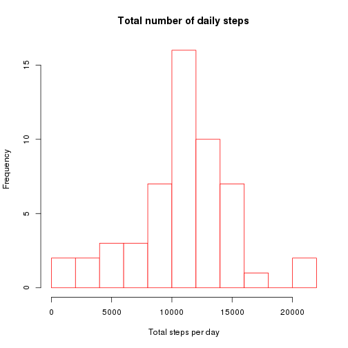

## Loading and preprocessing the data


```r
## unzip the datafile into a temporary directory 
## and read it into an R data frame called mydata
zipdir <- tempfile()
dir.create(zipdir)
unzip("activity.zip", exdir=zipdir)
files <- list.files(zipdir)
files <- files[grep("\\.csv$", files)] 
myfile <- file.path(zipdir,files[[1]])
mydata <- read.csv(myfile)
```


## What is mean total number of steps taken per day?


```r
## total number of steps taken each day
sum_per_date <- tapply(mydata$steps,mydata$date,sum)
hist(sum_per_date,breaks="FD",
     main="Total number of daily steps",
     xlab = "Total steps per day")
```

 

```r
## mean and median number of steps per day
mean_med <- c(summary(sum_per_date)[4],summary(sum_per_date)[3])
mean_med
```

```
##   Mean Median 
##  10770  10760
```

In a period of 61 days spread over a year,
the mean and median total number of steps taken per day were
10770 and 10760, 
respectively.

## What is the average daily activity pattern?


```r
mean_per_int <- aggregate(mydata$steps[!is.na(mydata$steps)],
                          list(interval = mydata$interval[!is.na(mydata$steps)]),
                          mean)
with(mean_per_int, plot(interval,x,type="l",
                        main="Average daily activity pattern",
                        ylab = "Mean steps per time interval",
                        xlab = "Time interval (minutes)"
                        )
     )
```

 

```r
max_int <- mean_per_int$interval[mean_per_int$x >= max(mean_per_int$x)]
```

On average, across all the days in the dataset, the maximum number of steps
occurs in the time interval at 835 minutes.

## Imputing missing values


```r
# number of complete observations in the dataset
cc <- complete.cases(mydata)
# number of NAs in the dataset
n_NA <- sum(!cc)
n_NA
```

```
## [1] 2304
```

```r
list_missing_val <- tapply(mydata$steps, mydata$date, is.na)
missing_val_per_day <- sapply(list_missing_val,sum)
missing <- missing_val_per_day[missing_val_per_day > 0]
missing
```

```
## 2012-10-01 2012-10-08 2012-11-01 2012-11-04 2012-11-09 2012-11-10 
##        288        288        288        288        288        288 
## 2012-11-14 2012-11-30 
##        288        288
```
The number of NAs in the dataset is 2304. These are in 
8 days during which no valid measurement was taken.  
We decided to fill in missing values in these days by substituting 
for each 5 minutes time interval the mean total number of steps taken 
in that interval. 
We investigate the impact of this strategy of imputing missing data by
calculating the histogram of total daily steps and the mean and median
total number of steps taken per day from the modified dataset and
comparing it with those obtained from the original dataset.


```r
#library(dplyr)
newdata <- merge(mydata,mean_per_int,sort=FALSE)
## to be continued...
```

## Are there differences in activity patterns between weekdays and weekends?


